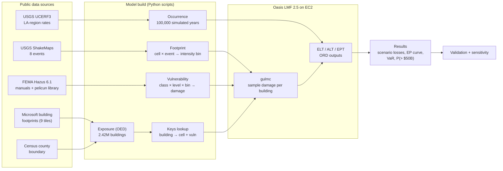
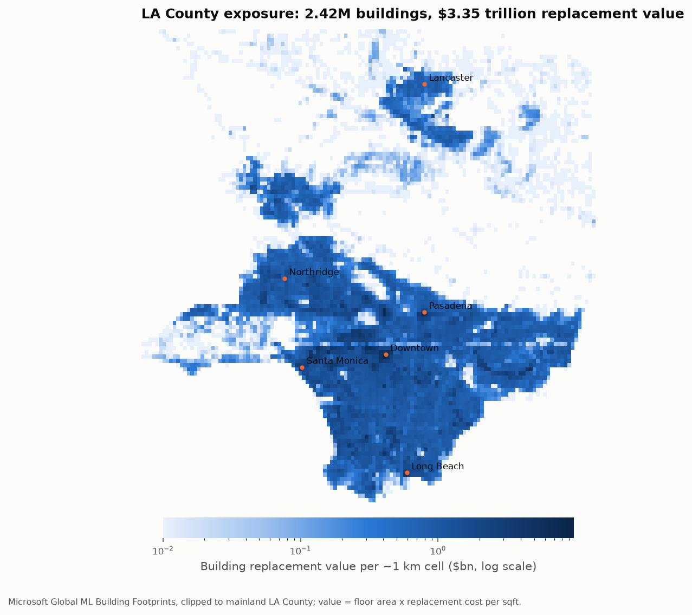
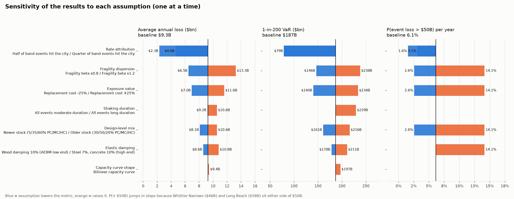

# Los Angeles Earthquake Catastrophe Model on Oasis LMF — Full Report

**As of:** model run completed 2026-10-08 02:25 UTC (2026-10-07 19:25 Pacific). Data downloaded
2026-10-07. Every number in this report describes that run; the data and software versions it
used are listed in [Section 10](#10-what-this-run-is-pinned-to-as-of-2026-10-08).

**Author:** Krish Gupta. Built with Claude Code.

---

## 1. Summary

We built an earthquake catastrophe model for Los Angeles County from public data and ran it on
the open-source **Oasis Loss Modelling Framework** (Oasis LMF 2.5) on an AWS EC2 machine, in Docker.

| Ingredient | Source | What it provides |
|---|---|---|
| **Hazard** | USGS ShakeMaps for 8 earthquakes, M5.9–7.7 | How hard the ground shook at each 1 km cell |
| **Vulnerability** | FEMA Hazus 6.1 capacity spectrum method | Fraction of a building's value lost for a given shaking |
| **Exposure** | Microsoft building footprints, LA County | 2,422,140 buildings, $3.35 trillion replacement value |
| **Frequency** | USGS UCERF3 earthquake rates, LA region | How often each type of event happens |

**Results:** ground-up loss to buildings (structure plus nonstructural components; no contents,
business interruption, fire or ground failure), in 2026 dollars.

| Deliverable | Result |
|---|---|
| Average annual loss (AAL) | **$9.3B** |
| VaR 1-in-100 (OEP) | **$155B** |
| VaR 1-in-200 (OEP) | **$185B** |
| VaR 1-in-250 (OEP) | **$186B** |
| P(an earthquake causes > $50B loss in a year) | **6.1%** (about 1-in-16 years) |
| P(total losses in a year > $50B) | 6.6% |

| Mw | Event | Loss | % of value |
|---|---|---|---|
| 5.9 | 1987 Whittier Narrows | $45B | 1.4% |
| 6.4 | 1933 Long Beach | $59B | 1.7% |
| 6.6 | 1971 San Fernando | $79B | 2.3% |
| 6.7 | 1994 Northridge | $158B | 4.7% |
| 6.8 | Raymond–Hollywood fault (USGS scenario) | **$186B** | 5.6% |
| 7.1 | 2019 Ridgecrest | $0.3B | 0.01% |
| 7.5 | 1952 Kern County | $7B | 0.2% |
| 7.7 | Southern San Andreas "ShakeOut" (USGS scenario) | $80B | 2.4% |


**The four things to take away:**
1. **Distance beats magnitude.** An M6.8 under Hollywood costs more than twice an M7.7 on the San
   Andreas, and an M7.1 at Ridgecrest costs almost nothing.
2. **The tail and the large scenarios agree with published estimates.** The 1-in-100 and
   1-in-250 losses, and the Northridge and ShakeOut losses, all fall inside or near published
   FEMA and vendor ranges.
3. **AAL and P(> $50B) are high, and we know why.** Each scenario stands in for every LA-region
   quake of its size, as if it always struck at the same spot. That is the single biggest
   assumption in the model (Section 7).
4. **Model risk is large and measurable.** On identical buildings and earthquakes, changing how
   damage is calculated moved Northridge from $299B to $158B.

---

## 2. How the pieces connect



How a single building becomes a loss:

1. **Exposure → keys.** The building at (34.05, −118.25) is a 3-storey concrete building (C2.L),
   moderate code, worth $X. The keys lookup gives it hazard cell `areaperil_id = n` and the
   vulnerability function for C2.L moderate code.
2. **Footprint.** In event 4 (Northridge), cell `n` had SA(0.3 s) = a and SA(1.0 s) = b, with
   moderate duration. That is intensity bin `i`.
3. **Vulnerability.** For C2.L moderate code in bin `i`, Hazus gives a probability for each
   damage level (0%, 0.9%, 4.3% … 100%).
4. **Oasis samples** 10 damage ratios from that distribution, multiplies by $X, and sums over
   all 2.4M buildings to get the event loss.
5. **Occurrence.** In the 100,000 simulated years, Northridge-type events occur in about 430 of
   them. Ranking each year's largest loss gives the EP curve; the 1-in-200 loss is the one
   exceeded in 0.5% of years.

| Stage | Script | Output |
|---|---|---|
| Hazard download | `scripts/fetch_shakemaps.py` | `data/raw/shakemaps/` |
| Hazard footprint | `scripts/build_footprint.py` | `model_data/footprint.csv`, `areaperil_grid.json` |
| Hazus tables | `scripts/extract_hazus_csm_tables.py`, `extract_hazus_lf.py` | `data/hazus/` |
| Vulnerability | `scripts/hazus_csm.py`, `build_vulnerability_csm.py` | `model_data/vulnerability.csv` and bin dictionaries |
| Exposure | `scripts/fetch_buildings.py`, `build_exposure.py` | OED file (Release v1.0), `outputs/exposure/` |
| Rates | `scripts/build_rates.py` | `model_data/events_p.csv`, `occurrence_lt.csv` |
| Keys lookup | `model/lookup.py` | runs inside Oasis |
| Oasis run | `scripts/run_oasis.sh` (`oasislmf model run`) | `outputs/oasis_run/` |
| Deliverables | `scripts/analyze_results.py`, `plot_results.py` | `outputs/results/` |
| Sensitivity | `scripts/sensitivity.py`, `plot_sensitivity.py` | `outputs/sensitivity/` |

---

## 3. The engine: Oasis LMF ([detail](step1_oasis_platform.md))

Oasis is an open-source framework that does the loss calculation; it has no science of its own.
The model supplies five things: a **footprint** (intensity per event and cell), a
**vulnerability** (damage distribution per intensity), an **exposure** file in the OED standard,
a **keys lookup** linking each building to its cell and vulnerability, and an **occurrence** file
of simulated years.

- **Platform:** Oasis 2.5 (OasisEvaluation) runs as 15 Docker containers on an AWS
  m7i-flex.large (2 vCPU, 8 GB RAM, 60 GB disk, Ubuntu 24.04): API server, workers, database,
  message queue, UI.
- **MDK:** the `oasislmf` Python package runs the same calculation directly from files. The
  final runs used the MDK.
- **Calculation:** `gulmc` samples ground-up loss for every building and event (10 samples). The
  ORD tools then produce the event loss table (ELT), annual loss table (ALT) and exceedance
  probability table (EPT).
- **Run:** 2,422,140 buildings × 8 events × 10 samples took **3.5 minutes**. The keys lookup
  matched every building, with **0 errors**.

---

## 4. Hazard: USGS ShakeMaps ([detail](step3_hazard.md))

**Why these events.** One per magnitude band, each chosen because it shakes LA. Historical
ShakeMaps come from the USGS ShakeMap Atlas, which reconstructs older events. Where LA has no
damaging historical quake in a band, we used official USGS scenarios: Raymond–Hollywood M6.8 and
the southern San Andreas ShakeOut M7.7.

**What is used.** The 5%-damped spectral acceleration at **0.3 s** (short-period shaking, which
drives stiff low-rise buildings) and **1.0 s** (long-period shaking, which drives flexible and
tall buildings), interpolated to a **0.01° (~1 km) grid** of 14,690 cells. Each event's
magnitude sets its Hazus **duration** class: M ≤ 5.5 short, M ≥ 7.5 long, otherwise moderate.

**What it shows.** Footprints vary enormously across events: value-weighted SA(1.0 s) is
0.107 g for Whittier Narrows, 0.27 g for Northridge and 0.04 g for Ridgecrest. Whittier and the
ShakeOut have nearly the same peak ground acceleration (0.15 g) but very different long-period
shaking, which is why PGA alone misleads (Section 9).


---

## 5. Vulnerability: FEMA Hazus capacity spectrum method ([detail](step2_vulnerability.md))

Damage depends on **how far a building sways**, not just on the peak jolt. Hazus models this in
steps; every parameter is extracted by script from the Hazus 6.1 Technical Manual, with table
numbers:

1. **Demand:** a response spectrum built from SA(0.3 s), SA(1.0 s) and magnitude (Equations 4-4, 5-11 to 5-13).
2. **Capacity:** a pushover curve per building type and design level, from yield point to
   ultimate point (Tables 5-12 to 5-15).
3. **Damping:** past yield, buildings dissipate energy, which reduces demand. Longer shaking
   degrades that damping, so it causes more damage (Equations 5-7 to 5-10, Table 5-42; elastic
   damping from the Hazus AEBM manual, Table 5.1).
4. **Performance point:** where demand meets capacity gives the peak displacement and
   acceleration.
5. **Damage:** fragility curves give damage-state probabilities for the structure, for
   drift-sensitive nonstructural parts (walls, finishes) and for acceleration-sensitive parts
   (ceilings, equipment) (Tables 5-19 to 5-34).
6. **Loss:** Hazus repair-cost ratios per occupancy. For a house at complete damage: 23.4%
   structure + 50% drift-sensitive + 26.6% acceleration-sensitive = 100%.

**In Oasis:** intensity bins are SA(0.3 s) × SA(1.0 s) × duration, giving 7,500 bins. There are
24 vulnerability functions (6 LA building classes × 4 design levels) and 147 exact damage
levels. Oasis needs a damage *distribution*, but Hazus gives each component's damage
separately, so we assume they move together. That keeps the mean exactly equal to Hazus; only
the spread is our assumption.

**Our own choices** (everything else is Hazus): the elliptical shape of the capacity curve
between yield and ultimate, and combining the components as perfectly dependent. Section 8 shows
the curve-shape choice moves results by about 5%.

**Superseded v1.** The first run used Hazus's "equivalent-PGA" shortcut, which maps peak ground
acceleration straight to damage. It overstated moderate-event losses by 2–100× against
benchmarks, so we replaced it (Section 9).

---

## 6. Exposure: Microsoft building footprints ([detail](step4_exposure.md))

**Source:** Microsoft Global ML Building Footprints (release 2026-02-03): building outlines with
an estimated height, from aerial imagery. Clipped to mainland LA County with the Census 2023
boundary.

| Step | Rule |
|---|---|
| Size | Footprint area in an equal-area projection; buildings under 400 sqft dropped |
| Floors | Height ÷ 3.3 m (height known for 96% of buildings) |
| Hazus class | Size rules: houses (W1), wood apartments (W2), tilt-up warehouses (PC1), low- and mid-rise concrete (C2L, C2M), steel towers (S1H) |
| Design level | Random draw from LA's approximate age mix: 15% pre-code, 50% moderate code, 35% high code |
| Value | Floor area × replacement cost ($175–475/sqft by class, 2026) |
| Output | OED location file, the Oasis industry standard |

| Class | Buildings | Value | Share |
|---|---|---|---|
| W1 houses | 1,958,462 | $1,366B | 41% |
| W2 wood apartments | 410,223 | $861B | 26% |
| C2.L concrete, 3 storeys | 16,934 | $472B | 14% |
| PC1 tilt-up | 31,165 | $382B | 11% |
| C2.M concrete, 4–7 storeys | 4,979 | $244B | 7% |
| S1.H steel towers | 377 | $28B | 1% |



---

## 7. Frequency: UCERF3 rates and the simulated catalogue

**Source:** USGS UCERF3 (Fact Sheet 2015-3009), Los Angeles region. Average repeat time of an
earthquake of at least magnitude M: M5 every 1.4 years, M6 every 10, M6.7 every 40, M7 every 61,
M7.5 every 109, M8 every 532.

**Method.** Exceedance rates are interpolated log-linearly (a piecewise Gutenberg–Richter
curve). Each event represents a magnitude band, with edges halfway between neighbouring
events, and its rate is the rate of quakes in that band. Then 100,000 years are simulated, with
Poisson occurrences of each event: 16,326 occurrences, 0.163 per year.

| Event | Band | Return period |
|---|---|---|
| Whittier Narrows | M5.75–6.15 | 11 yr |
| Long Beach | 6.15–6.5 | 27 yr |
| San Fernando | 6.5–6.65 | 105 yr |
| Northridge | 6.65–6.75 | 233 yr |
| Raymond–Hollywood | 6.75–6.95 | 175 yr |
| Ridgecrest | 6.95–7.3 | 166 yr |
| Kern County | 7.3–7.6 | 204 yr |
| ShakeOut | ≥ 7.6 | 150 yr |

**The key assumption.** Every LA-region quake in a band is treated as if it ruptured where that
band's event did. The UCERF3 LA region extends about 100 km from the city, so many real
ruptures would be farther from the dense core and cause less loss. This makes AAL and
P(> $50B) conservative, and Section 8 shows it is the largest lever in the model.

---

## 8. How firm are the results? Sensitivity

One assumption changed at a time. The baseline is our result and reproduces the Oasis event
means to within 1%.



| Assumption | Range | AAL | 1-in-200 | P(> $50B) |
|---|---|---|---|---|
| **Baseline** | | **$9.3B** | **$187B** | **6.1%** |
| Rate attribution | ½ or ¼ of band events hit the scenario location | $4.6B / $2.3B | $79B | 3.1% / 1.6% |
| Fragility spread | Hazus β × 0.8 / × 1.2 | $6.5B / $13.3B | $146B / $238B | 2.6% / 14.1% |
| Replacement cost | −25% / +25% | $7.0B / $11.6B | $140B / $234B | 2.6% / 14.1% |
| Design-level mix | Newer / older stock | $8.1B / $10.6B | $161B / $216B | 2.6% / 14.1% |
| Duration | All moderate / all long | $9.2B / $10.6B | $187B / $229B | 6.1% |
| Elastic damping | Low / high end of Hazus ranges | $10.8B / $8.6B | $211B / $178B | 14.1% / 6.1% |
| Capacity curve shape | Bilinear | $9.4B | $197B | 6.1% |

- **Where earthquakes happen** (rate attribution) matters more than anything about the buildings.
- **Fragility spread, building values and building age** each move the 1-in-200 by roughly ±25%.
- **Our own modelling choices** (curve shape) and damping within Hazus's ranges move results by
  10% or less.
- **P(> $50B) is a cliff.** Whittier ($46B) and Long Beach ($58B) sit either side of $50B, so it
  jumps between about 2.6% and 14% rather than moving smoothly. With only 8 events, a threshold
  probability depends on which events sit near it.

---

## 9. Validation

**Engine:** an independent pandas calculation (value × damage ratio, summed) reproduces every
Oasis event loss to within 1%. The Oasis setup, keys and binary files are correct.

**Against published estimates:**

| Measure | Ours (building only, 2026 $) | Published | Verdict |
|---|---|---|---|
| LA County 1-in-100 | $155B | $72B (FEMA Hazus P-366, incl. contents and income); $137–173B (AIR/RMS/EQECAT panel, 5 counties, economic) | Within the vendor range |
| LA County 1-in-250 | $186B | $163B (FEMA P-366); $215–263B (vendor panel) | Between the two |
| Northridge repeat | $158B | $90–155B economic incl. contents and BI (vendor panel, 2014) | Top of range |
| ShakeOut M7.8 | $80B | ~$70B building and contents shaking damage (USGS, $46B in 2008 $) | Close |
| Whittier Narrows | $45B | ~$1B ($358M in 1987) | **About 40× high** |
| LA County AAL | $9.3B | $2.7B (FEMA P-366); $3.0B (FEMA National Risk Index buildings) | **About 3× high** |

**Model versions.** The first run (v1) used the Hazus PGA shortcut, with extra ground-motion
spread on top of the Hazus dispersions:

| | v1 | v1 without the extra spread | v2 (current) |
|---|---|---|---|
| Whittier Narrows | $108B | $75B | $45B |
| Northridge | $299B | $255B | $158B |
| ShakeOut | $82B | — | $80B |
| AAL | $19.8B | — | $9.3B |

v2 is more defensible for four reasons: it is the method Hazus itself uses for buildings, it
captures spectral shape and duration, it moved in the direction the benchmarks required (small
events fell sharply, large ones barely moved), and every parameter traces to a FEMA table.

---

## 10. What this run is pinned to (as of 2026-10-08)

Results can change if any of these change. Re-running later may pull newer data.

| Input | Version / vintage used |
|---|---|
| ShakeMaps (ComCat) | Whittier, San Fernando, Northridge, Ridgecrest: Atlas versions updated 2020-07-07; Kern County 2020-09-10; Long Beach 2023-03-14; Raymond–Hollywood and ShakeOut scenarios updated 2026-10-01. Downloaded 2026-10-07. The script always takes the *preferred* (latest) product. |
| Microsoft footprints | Global ML Building Footprints release 2026-02-03 (published 2026-02-23); 9 level-9 quadkey tiles; downloaded 2026-10-07 |
| County boundary | US Census cartographic boundary 2023 (1:500k) |
| Earthquake rates | UCERF3 time-independent LA-region repeat times, USGS Fact Sheet 2015-3009 |
| Vulnerability | Hazus 6.1 Earthquake Model Technical Manual (FEMA 2024); Hazus AEBM manual Table 5.1; repair-cost ratios from simcenter-dlml 3.2 (Hazus v6.1) |
| Replacement costs | Assumed 2026 LA rebuild costs: $175–475/sqft by class |
| Benchmarks | Converted to 2026 $ approximately (CPI-style factors), not exposure-trended |
| Software | oasislmf 2.5.8 (MDK), Oasis platform 2.5 (`coreoasis/api_server:2.5`, `model_worker:2.5`), ods_tools 5.0.9, pelicun 3.10.0, pandas 2.3.3, numpy 2.4.6, geopandas 1.2.0 |
| Infrastructure | AWS EC2 m7i-flex.large, us-east-2, Ubuntu 24.04, Docker 29.8.2 |
| Random seeds | Design-level draw seed 20260107; occurrence simulation seed 7; Oasis sampling: 10 samples |
| Code | Repository state at tag `v1.0` plus later commits; exposure files in Release v1.0 |

---

## 11. Conclusions

1. **LA's earthquake tail is driven by moderate quakes close to the city, not the "Big One".**
   The worst loss came from an M6.8 under Hollywood ($186B). Northridge and San Fernando-type
   events follow. The M7.7 San Andreas is a $80B event because its fault is about 50 km away.
2. **Large-event losses of $150–190B are plausible for LA.** Three independent references
   (FEMA Hazus, a vendor panel, USGS scenarios) agree with our tail to within their own spread.
3. **Economic loss is far larger than insured loss.** About 12% of California homeowners have
   earthquake cover, so a $158B economic Northridge repeat is roughly a $12–24B insured event.
   The California Earthquake Authority sizes its $19.9B claims-paying capacity to about a
   1-in-390 event.
4. **Frequency and location assumptions matter as much as vulnerability.** Spreading the same
   UCERF3 rates over realistic rupture locations could cut AAL to roughly FEMA's $2.7–3.0B.
5. **Model risk is first-order.** On identical inputs, changing the damage method halved
   Northridge, and plausible ranges for Hazus parameters move the 1-in-200 by ±25%.

## 12. What this means for an ILS / cat bond investor

This is analysis of what the model shows, not investment advice.

- **Trigger design and basis risk.** Loss depends on where a quake ruptures more than on its
  magnitude. A magnitude-only parametric trigger could pay on a Ridgecrest-type event that
  costs nothing, and miss an M6.7 under the city that costs $150B+.
- **Don't take one model's number at face value.** Vulnerability choices moved losses by 2×
  here. A bond's modelled expected loss should be stress-tested under alternative vulnerability
  and frequency assumptions, and that uncertainty should be priced.
- **Match the loss measure to the trigger.** Indemnity bonds follow insured loss; industry-loss
  bonds follow PCS insured estimates. This model's economic, ground-up curve needs take-up
  rates and policy terms applied before it says anything about a bond layer.
- **Ask which events drive a layer.** With few events, a tranche's expected loss can sit on one
  or two scenarios.
- **Diversification.** California earthquake is uncorrelated with US hurricane, which is part of
  why ILS portfolios hold it despite the model uncertainty.

---

## 13. Risks and uncertainties register

| # | Item | Effect on results | Size | How it would be reduced |
|---|---|---|---|---|
| 1 | Each band event placed at its historical / scenario location | Overstates AAL and P(> $50B); overstates the tail | Largest: AAL could be 2–4× lower | Thousands of UCERF3 ruptures across the region with USGS ground-motion models |
| 2 | Only 8 events | EP curve is a staircase; 1-in-200 and 1-in-250 are the same event; P(> $50B) jumps between steps | Large for threshold metrics | Dense stochastic catalogue |
| 3 | Hazus conservative for moderate events | Overstates small-event losses (Whittier about 40× its benchmark) | Large for AAL, small for the tail | Calibrate to claims data (CEA, PCS) |
| 4 | Fragility dispersion (Hazus β) | ±20% β moves the 1-in-200 by −22% / +27% | Large | Hazus-published values; test alternatives |
| 5 | Building type inferred from size | Misclassifies some buildings both ways | Medium | LA County assessor parcels (use, year, material) |
| 6 | Design level drawn at random from an age mix | Correct county-wide, wrong for individual buildings; older stock +16% at 1-in-200 | Medium | Year built from assessor or USACE National Structure Inventory |
| 7 | No unreinforced masonry or non-ductile concrete | **Understates** loss: these are LA's most dangerous types | Medium | Assessor data plus the city's soft-story and non-ductile concrete inventories |
| 8 | Replacement cost per sqft | Linear: ±25% gives ±25% loss | Medium | RSMeans or insurer cost data |
| 9 | ML building heights | Some floor counts wrong (trees, roof shapes) | Small–medium | Lidar, assessor storeys |
| 10 | Benchmarks converted to 2026 $ approximately | Comparisons are only good to about ±50% | Medium | Proper exposure-trending of historical losses |
| 11 | Capacity curve shape; component dependence | Our choices, not Hazus's | Small (≈5%; the mean is unaffected by dependence) | Hazus software implementation details |
| 12 | Spatial correlation of damage not modelled | Understates the spread of portfolio loss, not the mean | Small for means, matters for insured layers | Oasis correlation settings |
| 13 | Scope: no contents, BI, fire following, liquefaction, landslide, tsunami | **Understates** total economic loss; fire alone was $87B in ShakeOut | Large for total economic loss | Add Hazus contents/BI and secondary-peril modules |
| 14 | Ground-up only, no insurance terms | Not an insured loss; not a bond loss | n/a | Apply take-up, deductibles, limits (Oasis financial module) |
| 15 | Time-independent rates | Ignores elapsed time since the last rupture on faults like the San Andreas | Small–medium | UCERF3 time-dependent probabilities |
| 16 | Data vintage | ShakeMaps and footprints can be revised after 2026-10-07 | Small | Pinned versions in Section 10 |

**Net direction:** for the **AAL and P(> $50B)**, items 1–3 dominate, so the published numbers
are **upper-end** estimates. For the **tail**, the overstatements (1, 3) and understatements
(7, 13) partly cancel, which is consistent with our 1-in-100 and 1-in-250 sitting inside
published ranges.

---

## 14. Reproduce

```bash
# On a fresh Ubuntu EC2 (50 GB+ disk)
bash scripts/step1_setup_oasis.sh                # Docker, Oasis platform, MDK
python scripts/fetch_shakemaps.py
python scripts/fetch_buildings.py
python scripts/extract_hazus_csm_tables.py <Hazus 6.1 EQ Technical Manual.pdf>
python scripts/extract_hazus_lf.py
python scripts/build_vulnerability_csm.py
python scripts/build_footprint.py
python scripts/build_exposure.py
python scripts/build_rates.py
bash scripts/run_oasis.sh
python scripts/analyze_results.py && python scripts/plot_results.py
python scripts/sensitivity.py && python scripts/plot_sensitivity.py
```

---

## 15. Glossary

| Term | Meaning |
|---|---|
| AAL | Average annual loss: expected loss per year, averaged over many years |
| OEP | Occurrence exceedance probability: chance the largest single event in a year exceeds a loss |
| AEP | Aggregate exceedance probability: chance the total of a year's events exceeds a loss |
| VaR 1-in-N | Loss with a 1/N annual chance of being exceeded (1-in-200 = 0.5%) |
| ShakeMap | USGS map of ground shaking for an earthquake |
| PGA | Peak ground acceleration: the sharpest single jolt |
| SA(T) | Spectral acceleration: how strongly a building with natural period T responds |
| Capacity spectrum method | Hazus method finding where a building's capacity meets the shaking demand |
| Fragility curve | Probability of reaching a damage state given demand |
| Design level | Hazus seismic code era: pre-code, low, moderate, high |
| OED | Open Exposure Data, the industry-standard exposure format Oasis reads |
| Footprint | Oasis file of intensity per event and location |
| Ground-up loss | Loss before any insurance deductibles or limits |
| UCERF3 | USGS Uniform California Earthquake Rupture Forecast, version 3 |
| ILS | Insurance-linked securities, such as cat bonds |

## Sources

- USGS ShakeMap and Atlas: https://earthquake.usgs.gov/data/shakemap/
- USGS UCERF3 Fact Sheet 2015-3009: https://pubs.usgs.gov/fs/2015/3009/
- FEMA Hazus 6.1 Earthquake Model Technical Manual (2024); Hazus AEBM manual: https://www.fema.gov/flood-maps/tools-resources/flood-map-products/hazus/user-technical-manuals
- SimCenter Damage & Loss Model Library / pelicun: https://github.com/NHERI-SimCenter/pelicun
- Microsoft Global ML Building Footprints: https://github.com/microsoft/GlobalMLBuildingFootprints
- FEMA P-366 (2023): https://www.fema.gov/sites/default/files/documents/fema_p-366-hazus-estimated-annualized-earthquake-losses-united-states.pdf
- FEMA National Risk Index: https://hazards.fema.gov/nri/
- PEER Northridge20 vendor panel (2014): https://northridge20.peer.berkeley.edu/wp-content/uploads/2010/10/DirectImpacts_Tillman.pdf
- Porter et al. 2011, ShakeOut: https://pubs.usgs.gov/publication/70034995
- Field et al. 2005, Puente Hills: https://pubs.usgs.gov/publication/70029508
- California Department of Insurance, 2024 earthquake data call: https://www.insurance.ca.gov/0400-news/0200-studies-reports/0300-earthquake-study/upload/EQEXP2024Summary.pdf
- KBRA, CEA claims-paying capacity (2026): https://www.kbra.com/publications/FFLhbLwP
- Oasis LMF: https://oasislmf.org
