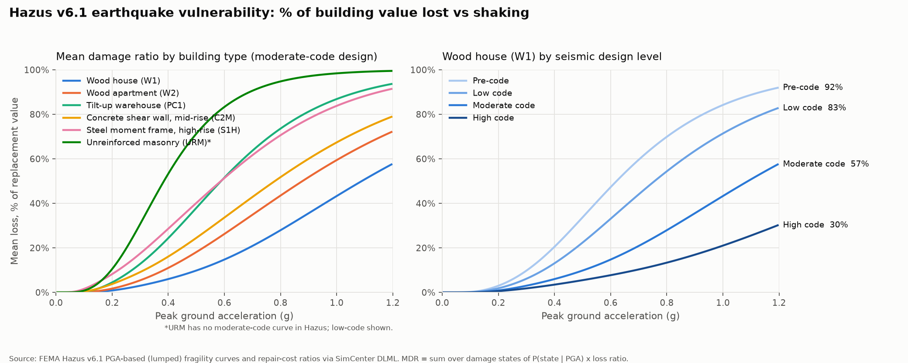

# Step 2 — Vulnerability from FEMA Hazus

**Question answered:** if a building of type X is shaken at intensity Y, what fraction of its
value is lost?



## Source

FEMA Hazus v6.1 earthquake building damage functions, read from the SimCenter Damage & Loss
Model Library (`simcenter-dlml`, the data package behind pelicun).

The full Hazus method works from spectral displacement through a capacity spectrum. Hazus
also publishes **lumped ("LF") fragility curves whose demand is peak ground acceleration
(PGA)**. We use the PGA curves because a USGS ShakeMap gives PGA directly, so hazard
(Step 3) and vulnerability are measured on the same scale.

## From fragility to loss, in three equations

1. **Fragility.** For each damage state k (1 Slight, 2 Moderate, 3 Extensive, 4 Complete):

   P(DS ≥ k | PGA = a) = Φ( ln(a / θ_k) / β_k )

   θ_k is the median PGA at which a building reaches state k, and β_k is the lognormal
   dispersion. For example, a moderate-code wood house has θ = 0.24, 0.43, 0.91, 1.34 g and
   β = 0.4.

2. **Damage-state probabilities.** P(DS = k | a) = P(DS ≥ k | a) − P(DS ≥ k+1 | a).

3. **Loss.** Each state has a repair cost as a fraction of replacement value, set by
   occupancy. For RES1 (single-family) these are 2%, 10%, 44.7% and 100%. The mean damage
   ratio is

   MDR(a) = Σ_k P(DS = k | a) × LR_k

## Building classes

| Class | Hazus type | Occupancy (sets cost ratios) | Typical LA building |
|---|---|---|---|
| W1 | Light wood frame | RES1 | Single-family house |
| W2 | Commercial wood frame | RES3 | Wood apartment block |
| RM1.L | Reinforced masonry, low-rise | COM1 | Strip retail |
| URM.L | Unreinforced masonry, low-rise | COM1 | Pre-1933 brick building |
| PC1 | Precast tilt-up | IND2 | Warehouse |
| C2.L / C2.M / C2.H | Concrete shear wall | RES3 / RES3 / COM4 | Apartments, offices |
| S1.L / S1.M / S1.H | Steel moment frame | COM4 | Offices, downtown towers |

Each class comes at up to four **seismic design levels**: High, Moderate, Low and Pre-code.
That gives **42 vulnerability functions**, listed in `model_data/vulnerability_dict.csv`.
Step 4 assigns each building a class and design level.

## How it becomes Oasis files

Oasis does not store a single MDR curve. It stores a **probability distribution of damage
in each intensity bin**, so it can sample uncertainty in the loss.

- `intensity_bin_dict.csv`: 201 PGA bins, 0.01 g wide from 0 to 2 g, plus one bin above 2 g.
- `damage_bin_dict.csv`: 9 damage bins equal to the **exact Hazus loss ratios**
  (0, 2%, 10%, 35.5–44.7%, 100%), with bin_from = bin_to so nothing gets smeared.
- `vulnerability.csv`: for each (function, PGA bin), the probability of each damage bin,
  i.e. P(damage state | PGA). Each row-group sums to 1.

So the damage distribution Oasis samples from is exactly the Hazus damage-state
distribution, and its mean equals the MDR curve above.

## Reading the chart

- At about 0.3 g, typical strong shaking in a moderate earthquake, a code-designed wood
  house loses about 3%, while low-code unreinforced masonry loses about 32%.
- Design level matters as much as structure type. At 0.6 g a pre-code wood house loses
  about 48%; a high-code one loses about 8%.
- Wood houses are the most resilient type. That is one reason LA's residential losses stay
  moderate in all but the strongest shaking.

## Simplifications to state when presenting

- **PGA only.** Tall buildings respond more to long-period shaking (spectral acceleration
  at about 1 s), so PGA understates the damage they take from large, distant events.
- **No uncertainty within a damage state.** Each state uses its single Hazus loss ratio.
  Uncertainty comes only from which state the building ends up in.
- **Building damage only.** No contents, business interruption, ground failure
  (liquefaction or landslide), or fire following earthquake. Northridge's insured loss
  included significant contents and business-interruption claims.

## Reproduce

```bash
python scripts/extract_hazus_lf.py      # Hazus tables -> data/hazus/
python scripts/build_vulnerability.py   # -> model_data/*.csv
python scripts/plot_vulnerability.py    # -> outputs/vulnerability/mdr_curves.png
```
