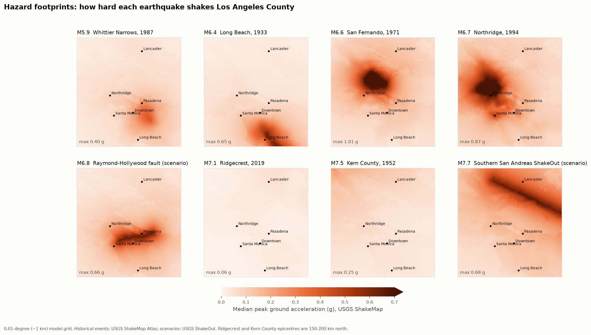

# Step 3 — Hazard from USGS ShakeMaps

**Question answered:** for each earthquake, how hard did the ground shake at each point in
Los Angeles?



## Event set

One event per magnitude band, chosen because each one shakes LA. Where LA has no damaging
historical quake in a band, we use an official USGS scenario.

| ID | Mw | Event | Type | LA max PGA | LA cells > 0.1 g |
|---|---|---|---|---|---|
| 1 | 5.9 | 1987 Whittier Narrows | Historical | 0.40 g | 21% |
| 2 | 6.4 | 1933 Long Beach | Historical (reconstructed) | 0.65 g | 20% |
| 3 | 6.6 | 1971 San Fernando | Historical (reconstructed) | 1.01 g | 60% |
| 4 | 6.7 | 1994 Northridge | Historical | 0.87 g | 71% |
| 5 | 6.8 | Raymond–Hollywood fault | USGS scenario | 0.66 g | 45% |
| 6 | 7.1 | 2019 Ridgecrest | Historical, about 200 km away | 0.06 g | 0% |
| 7 | 7.5 | 1952 Kern County | Historical (reconstructed) | 0.25 g | 15% |
| 8 | 7.7 | Southern San Andreas (ShakeOut) | USGS scenario | 0.68 g | 83% |

The headline lesson is that **magnitude is not loss; distance is**. The M7.1 Ridgecrest
quake barely moves LA (0.06 g at most), while the M5.9 Whittier Narrows quake directly
underneath reaches 0.40 g.

Historical ShakeMaps before about 1990 come from the USGS ShakeMap Atlas. These
reconstruct shaking from the fault model, ground-motion prediction equations and
intensity reports. The configuration is in `data/events.csv`.

## What a ShakeMap is

A regular lon/lat grid, 0.008–0.017° spacing (about 1–2 km), with the median ground motion
at each point: PGA (%g), PGV, MMI and spectral accelerations. A companion
`uncertainty.xml` gives the standard deviation of ln(PGA). Uncertainty is small near
seismic stations and larger far from them, typically σ ≈ 0.4–0.6.

## From ShakeMap to Oasis footprint

1. **Model grid.** A regular 0.01° grid (about 1 km) over mainland LA County, giving
   14,690 cells. Each cell is one Oasis `areaperil_id` (`model_data/areaperil_grid.json`).
   In Step 4, every building is assigned the cell it sits in.
2. **Interpolate.** Bilinear interpolation of the median **SA(0.3 s)** and **SA(1.0 s)**
   to each cell centre. PGA is kept for maps only.
3. **Add duration.** The event's magnitude sets its Hazus duration class (M ≤ 5.5 short,
   M ≥ 7.5 long, otherwise moderate).
4. **One bin per cell.** (SA 0.3 s, SA 1.0 s, duration) maps to one of the 7,500
   capacity-spectrum intensity bins with probability 1. That gives 117,520 footprint rows.

**Why no extra ground-motion uncertainty.** The Hazus fragility dispersions (β ≈ 0.6–1.0)
already include variability in the demand spectrum, and Hazus itself runs ShakeMaps at
their median values. An earlier version (v1, PGA) spread each cell over a lognormal PGA
distribution using ShakeMap's `uncertainty.xml`. Doing that on top of Hazus β would count
the same uncertainty twice.

## Simplifications to state when presenting

- Damage is sampled independently per building. Real ground-motion errors are spatially
  correlated, so this understates the spread of the portfolio loss around its mean. The
  mean itself is unaffected.
- The 0.01° grid smooths sharp local effects such as basin edges and individual hillsides.

## Reproduce (on EC2)

```bash
python scripts/fetch_shakemaps.py   # ~240 MB of ShakeMap XML -> data/raw/shakemaps/
python scripts/build_footprint.py   # -> model_data/footprint.csv, outputs/hazard/*.csv
python scripts/plot_footprints.py   # -> outputs/hazard/footprint_maps.png
```
