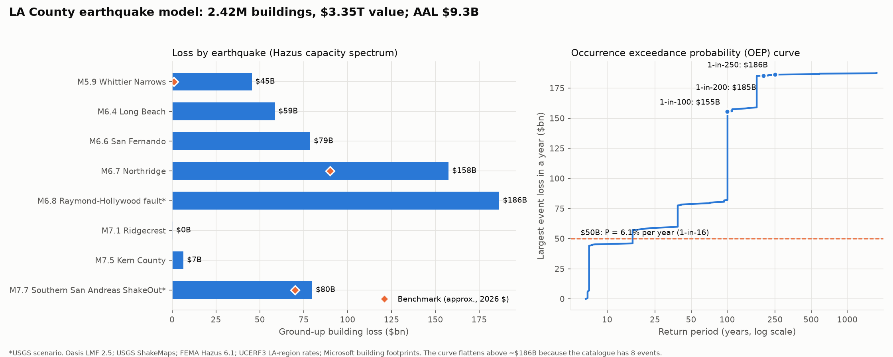

# Step 5 — Run the model: scenario losses, EP curve, VaR, P(loss > $50B)



## Headline numbers

Ground-up **building** loss (structure plus nonstructural components; no contents, business
interruption, fire following, or ground failure) for 2.42M LA County buildings worth $3.35T.

| Metric | Value |
|---|---|
| Average annual loss (AAL) | **$9.3B** |
| VaR 1-in-100 (OEP) | **$155B** |
| VaR 1-in-200 (OEP) | **$185B** |
| VaR 1-in-250 (OEP) | **$186B** |
| P(an event costs > $50B in a year) | **6.1%** (about 1-in-16 years); 6.2% from the simulated catalogue |
| P(total annual loss > $50B) | 6.6% |

### Loss by earthquake

| Mw | Event | Mean loss | % of value | Return period of its band |
|---|---|---|---|---|
| 5.9 | 1987 Whittier Narrows | $45B | 1.4% | 11 yr |
| 6.4 | 1933 Long Beach | $59B | 1.7% | 27 yr |
| 6.6 | 1971 San Fernando | $79B | 2.3% | 105 yr |
| 6.7 | 1994 Northridge | $158B | 4.7% | 233 yr |
| 6.8 | Raymond–Hollywood fault (USGS scenario) | $186B | 5.6% | 175 yr |
| 7.1 | 2019 Ridgecrest | $0.3B | 0.01% | 166 yr |
| 7.5 | 1952 Kern County | $7B | 0.2% | 204 yr |
| 7.7 | Southern San Andreas ShakeOut (USGS scenario) | $80B | 2.4% | 150 yr |

**Distance beats magnitude.** The M6.8 scenario under Hollywood costs more than twice as
much as the M7.7 San Andreas rupture 50 km away, and the M7.1 Ridgecrest quake costs almost
nothing.

## How the run works

1. **Keys lookup** (`model/lookup.py`). Every OED location gets its 1 km hazard cell
   (`areaperil_id`) and its Hazus class × design-level vulnerability function. All
   2,422,140 buildings matched, with 0 errors.
2. **Oasis ground-up loss** (`gulmc`). For each event and building: look up the cell's
   intensity bin, which is (SA 0.3 s, SA 1.0 s, duration). Sample 10 damage ratios from the
   vulnerability distribution and multiply by building value. This takes 3.5 minutes on
   2 vCPUs.
3. **Catalogue.** Each event's annual rate comes from UCERF3 LA-region recurrence (Step 3
   rates), simulated over 100,000 Poisson years (`model_data/occurrence_lt.csv`).
4. **ORD outputs.** Event loss tables (ELT), period loss and AAL (ALT), and exceedance
   probability tables (EPT: OEP/AEP, full uncertainty). The results are computed by
   `scripts/analyze_results.py`.

**OEP vs AEP.** OEP is the chance that the *largest single event* in a year exceeds a loss;
AEP is the chance that the *sum of all events* in a year exceeds it. With at most a few
damaging quakes per year, they're nearly equal here.

**VaR.** The 1-in-200 VaR is the loss with a 0.5% annual chance of being exceeded; it is
the standard solvency (Solvency II) measure.

## Validation

The Oasis engine was checked independently: summing TIV × P(intensity) × MDR in pandas
reproduces every Oasis event mean to within 0.5%.

| Event | Model | Benchmark (2026 $, approx.) | Source |
|---|---|---|---|
| M7.7 ShakeOut | $80B | ~$70B | USGS ShakeOut Scenario: $46B shaking damage to buildings and contents (2008 $), all of Southern California |
| M6.7 Northridge | $158B | ~$80–100B buildings | 1994: $40B direct economic; RMS 2014: up to $155B *total* economic for a repeat |
| M5.9 Whittier Narrows | $45B | ~$1B | $358M property damage (1987 $) |

### What changed between model versions

| | v1: Hazus PGA ("equivalent-PGA") fragility | v2: Hazus capacity spectrum (current) |
|---|---|---|
| Whittier Narrows | $108B | $45B |
| Northridge | $299B | $158B |
| ShakeOut | $82B | $80B |
| AAL | $19.8B | $9.3B |

v1 used the Hazus shortcut that maps PGA directly to damage. It was calibrated for large
events, so it overstated damage from moderate quakes, whose shaking is short-period and
brief. v2 uses the full Hazus method, which accounts for each event's spectrum and duration.
Large events barely moved; small ones fell by half.

## Limitations, in order of impact

1. **Rates are conservative.** Each event stands for *every* LA-region quake in its
   magnitude band, as if it struck where the historical one did. Most real ruptures in the
   UCERF3 LA region (about 100 km around LA) are farther from the dense core. This
   inflates P(> $50B) and the AAL, so treat 6% as an upper-end estimate.
2. **Eight events is a thin catalogue.** The EP curve is a staircase and flattens at the
   largest event ($186B), so the 1-in-200 and 1-in-250 VaR are both "the Raymond–Hollywood
   scenario". A production model uses thousands of stochastic ruptures. The next step is
   to sample UCERF3 ruptures and use USGS ground-motion models.
3. **Hazus is conservative for moderate events** (Whittier is about 40× its 1987 benchmark),
   largely from "slight damage" tails across millions of buildings.
4. **Exposure inference.** Building type comes from footprint size and height, and design
   level from a county-wide age mix, because there's no year-built data. Using assessor
   parcel data would sharpen this.
5. **Scope.** Building damage only. Contents, business interruption, fire following,
   liquefaction and landslide are excluded. Ground-up loss means no deductibles or limits.

## Reproduce (on EC2)

```bash
python scripts/build_vulnerability_csm.py   # Hazus CSM vulnerability -> model_data/
python scripts/build_footprint.py           # ShakeMap spectra -> footprint
bash scripts/run_oasis.sh                   # compile binaries + Oasis run (~4 min)
python scripts/analyze_results.py           # -> outputs/results/
python scripts/plot_results.py              # -> outputs/results/results.png
```
